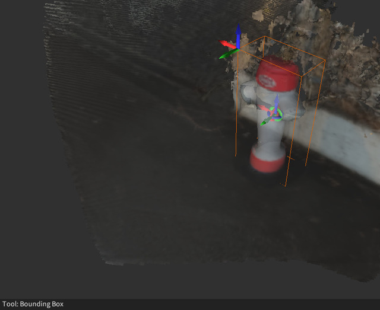
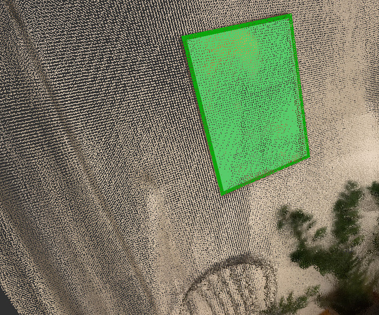

# 3D Data Annotation Tool

This project is a graphical user interface for annotating point clouds and [Stray scenes](https://docs.strayrobots.io/formats/data.html).

Several different label types are supported, including:
- Bounding boxes
- Keypoints
- Rectangles

### Bounding Box Labels



An example of a bounding box is shown above. They have the following properties:
- `class_id` the class id of the label.
- `position` the x, y, z position relative to the point cloud.
- `orientation` the rotation that transforms vectors in the box coordinate frame to the point cloud coordinate frame.
- `dimensions` three values denoting the width along the x, y and z axes in the bounding boxes local coordinate frame.

### Keypoint Labels


Keypoints are individual points in the global coordinate frame. They have the following properties:
- `class_id` the class id of the label.
- `position` the x, y, z position in the global frame.

### Rectangle Labels



Rectangles, show above, are rectangular planes that have a size (height and width), an orientation and position.

The properties are:
- `class_id` the class id of the label.
- `position` the x, y, z position of the center in the global frame.
- `orientation` the rotation taking vectors in local frame to the world frame.
- `size` width and height of the rectangle.

## Installation

### Install Dependencies - Mac
1. Install Homebrew: https://brew.sh/
2. Run `brew update && brew install cmake libomp eigen boost git-lfs pkg-config`

### Install Dependencies - Linux
1. RUN `sudo apt install libeigen3-dev libglfw3-dev libomp-dev libxinerama-dev libxcursor-dev libxi-dev git-lfs cmake libboost-all-dev`

### Build and install the annotation tool
1. Get the source code `git clone https://github.com/StrayRobots/3d-annotation-tool.git` (requires [git](https://git-scm.com/))
2. Navigate to the `3d-annotation-tool` directory (e.g. `cd 3d-annotation-tool`)
3. Initialize git submodules with `git submodule update --init --recursive`
4. Create a build directory with `mkdir build`
5. Pull `git-lfs` objects (helper meshes etc) with `git lfs install && git lfs pull`
6. To build the project run `cd build && cmake .. && make -j8` (`-j8` specifies the number of parallel jobs, for a fewer jobs use a lower number (than `8`))
7. The executable is called `pointcloud`, it can be executed with `./pointcloud <path-to-pointcloud>`. You can find an example `cloud.ply` point cloud  from [here](https://stray-data.nyc3.digitaloceanspaces.com/tutorials/cloud.ply). `<path-to-pointcloud>` should then specify the absolute path to the downloaded file.
## Usage

Run `./pointcloud <path-to-pointcloud>` to open a point cloud in the viewer. Currently only `.ply` point clouds are supported. Annotations are saved into a file of with the same filename but a `.json` file extension. In the point cloud annotation tool, you can move to the next point cloud in the same directory as `<path-to-pointcloud>` using `tab`.

Stray scenes can be opened with the `./studio` program running `./studio <path-to-scene>`. An example `cloud.ply` point cloud can be downloaded from [here](https://stray-data.nyc3.digitaloceanspaces.com/tutorials/cloud.ply).

The keyboard shortcuts are:
- `ctrl+s` to save the annotations.
- `k` switches to the keypoint tool.
- `b` switches to the bounding box tool.
- `r` switches to the rectangle tool.
- `v` switches to the move tool.


## Running tests

In your build directory, run:
```
cmake .. -DBUILD_TESTS=1
make build_tests
ctest
```

## Code formatting

Code can be formatted using clang-format.

Install clang-format on Mac (brew):

`brew install clang-format`

Install clang-format on Ubuntu:

`sudo apt install clang-format`

There's a script that runs formatting on all .h and .cc files based on the .clang-format file. Usage: `./run_formatting`


## Community

We have an open Slack workspace for discussion about the project, Q&A, and point cloud annotation in general. Join the workspace via the invite link [here](https://join.slack.com/t/pointcloudstu-z352533/shared_invite/zt-15u80fl51-~iwhKfXYjlRH2djTrTYLHg).
